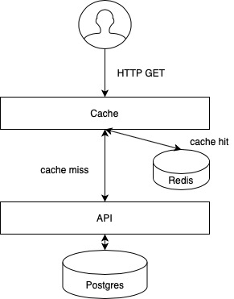

# Environment Air Quailty Measurement


## Design Decisions

### API 

The backend API is implemented in Python 3.8 with Flask, which is a plug-n-play micro-framework for web application development. This app exposes an API REST (port 5000 by default) endpoint, `/air_quality` which returns a well-formed JSON with all all the data stored in the Postgres database (will be commented later). It also has a `/` endpoint enabled for testing purpose. This app is completely stateless and isolated, so it can be scaled up and down without any restriction.

The application has a `config.py` file which contains all the configuration related to the application. This configuration should be different between environments, later we'll discuss how to manage this configuration. There's also a `models.py` configuration file which contains the data model of the Postgres table queried by the application.

This application is served alongside a Dockerfile and a `requirements.txt` file for properly build the application for Cloud Native environments.


### Cache

This app, like the one before commented is also developed in Python 3.8 with Flask. This cache acts as a frontend for the real API, it doesn't do any work at all, it accepts any HTTP GET request, if there is a cached response JSON for the queried endpoint it serves the cached data otherwise it redirects the request to the API backend which will query postgres for the data. The flow is the next:





1. The cache accepts a HTTP request to the `/air_quality` endpoint (or any other)
2. The cache checks if there's already a cached version of the response JSON
   1. If there is a cache miss, the cache will query the API backend for the necessary data, and save the data in the cache for next requests
   2. If there is a cache hit the data will be served from the cache
3. The data is returned to the client

A Redis instance it's deployed with the cache app as a lightning-fast cache database for storing the response JSONs

Like the API backend app, the cache app has been served alongside a Dockerfile and a `requirements.txt` file for properly build the application for Cloud Native environments. There's also a `config.py` file for this application for configuration management.

#### Cache data model

The data model for the cache has been simplified for the purpose of the application. The way it deals with stale data it's through an expiration time for the stored data (the cached one). It's configured to store the list of JSON with the air quality measurements for only 30s, so every 30 seconds no matter the data it's queried or not it will expire and the next request will force the cache to query the data from API backend. This data model does not guarantee consistency against the final data (Postgres). The key for the data stored in Redis is a `hash()` of the URL endpoint of the HTTP request, `/air_quality` in this case, this way we assure that there's a unique entry in Redis for each HTTP GET request.


### Database

The relational database chosen for the application it's Postgres. The way the data needed for the API it's initialized is through a native mechanism in the Postgres official docker image. It allows the user to upload a `init-script.sh` script to the containerized application for data initialization. This `init-script.sh` file is responsible for creating a schema and a table for the `air_quality_measurements` data (the `.csv` file in the `postgres` directory), also it creates an user/password credentials for querying this table. 

The table schema is the next:

|  Column Name |         Column Type         | Example                   |
| -----------: | :-------------------------: | ------------------------- |
| time_instant | timestamp without time zone | 2020-01-01 00:00:00.00000 |
|    id_entity |    character varying(50)    | aq_salvia                 |
|          so2 |      double precision       | 6.80117094260474          |
|          no2 |      double precision       | 48.398337879833704        |
|           co |      double precision       | 0.657363926741451         |
|           o3 |      double precision       | 48.49706558445371         |
|         pm10 |      double precision       | 20.1015302324903          |
|        pm2_5 |      double precision       | 9.137353903174679         |


No further modifications have been added to the official Postgres docker image.


### Credentials

The stack is designed to be securely deployed with all the needed credentials with the help of environment variables. In the root directory there is a `environment.env` file which contains all the environment variables needed to be defined prior to the deployment of the stack. The variables are:

|  Environment Variable | Default Value | Purpose                           |
| --------------------: | :-----------: | --------------------------------- |
|         POSTGRES_HOST |   postgres    | Postgres instance dns             |
|         POSTGRES_PORT |     5432      | Postgres instance exposed port    |
|         POSTGRES_USER |   postgres    | Postgres admin user               |
|     POSTGRES_PASSWORD |       -       | Postgres admin password           |
|     POSTGRES_API_USER |      api      | API user in postgres              |
| POSTGRES_API_PASSWORD |       -       | API user password in postgres     |
|   POSTGRES_API_SCHEMA |      api      | API schema in postgres            |
|            REDIS_HOST |     redis     | Redis instance dns                |
|            REDIS_PORT |     6379      | Redis instance exposed port       |
|          BACKEND_HOST |   api-rest    | API backend instance dns          |
|          BACKEND_PORT |     5000      | API backend instance exposed port |


### CI/CD

In order to be able to do a Continuous Integration workflow we'll need a CI/CD tool like Travis or Jenkins. We can take two approaches, the first one is to add a Jenkinsfile, in the case we use Jenkins, that defines all the Jobs that our application will go through after the interaction with the VCS, in the other case we can configure the Jobs directly from the Jenkins server. An example workflow could be:

1. We push our `feature` branch to the VCS server
2. Jenkins will run a PyLint job to the Python code, in the case of the API REST application
3. Jenkins will run different unit tests against the code
4. If everything goes OK Jenkins merge the `feature` branch with the `develop` branch
5. Jenkins will run different integration test against the code
6. If everything goes OK and Continuous Deployment its enabled the code will be deployed to the UAT environment


We should configure in Jenkins the differents kubeconfigs and needed credentials to deploy in our different Kubernetes environment based on the branches we push


### Monitoring, logging and backup

#### Monitoring

Our option is Prometheus, we can export a `/metrics` endpoint in both `api-cache` and `api-rest` applications, this exported metrics could be later be collected by Prometheus and graphed in a monitoring tool like Grafana. This approach lets us to scale up and down the application without the need of any sync between the Prometheus server and different application replicas deployed.

The Prometheus option has a bunch of exporters related to Kubernetes that allows us to monitoring the different Kubernetes components and also allows us to configure alerts based on metrics to have a 24x7 knowledge of our platform behaviour.


#### Logging

Here we can use a framework like Fluentd or Logstash (or Beats) for the agent-side. For the server-side we can use ElasticSearch for storing the logs and Kibana as UI frontend for querying the data. At the moment our application does not log any custom log (only the Flask framework ones), but we can add some features to the `api-N` applications to log anything we want.


#### Backup

The options here are limited to the platform where the application will be deployed. The easiest way to do this is to use Kubernetes Persistent Volumes backed by, for example, AWS EBS that will assure us no data loss. Other approach, in case we use a on-premise fully managed platform is to use RAID 1 for servers disks. 

This point will not metion the problems associated for deploying a statefull application like Postgres or redis in a stateless-oriented environment like Kubernetes.


## Deployment

The stack is designed to be able to be deployed both locally with Docker and distributed with Kubernetes. We'll be discussing the two options

### Docker

In the root directory there is a `docker-compose.yml` file that will deploy all the stack locally in the docker daemon. 

The steps for deploying in Docker are the next:

```bash
# Assign values for POSTGRES_PASSWORD and POSTGRES_API_PASSWORD variables in the 
#		environment.env file
# You can generate a random password with
# $ cat /dev/urandom | base64 - | head -c 16
$ vi environment.env
...
# Load all the environment variables from environment.env
$ set -a; source environment.env; set +a
# Build up the stack
# --build flag it's important for building the images needed for the stack
# -d flag it's important for background execution of the stack
$ docker-compose up -d --build
# We can now query the Cache frontend which is exposed on localhost:8080 port
$ curl localhost:8080/air_quality
# Now that we've check that everything works fine we can tear down the stack
$ docker-compose down
```


### Kubernetes

In the root directory there is a `kubernetes/` directory which contains all the needed YAML files for deploying the stack in a Kubernetes compliance environment.

Considerations:

+ This deployment will NOT work on a real environment because the Docker images needed for the stack are build and located locally. For real environment the images should be published in a private/public registry
+ Is REQUIRED to deploy the Secret object before the stack deployment. This secret object contains all the environment variables needed for the proper operation of the stack.
+ There's no data persistence between executions. If there's a real need for persistence of the stored data (redis, postgres) you should use Persistent Volumes or implement other solution.

The steps for deploying in Kubernetes are the next:

```bash
# In this case we will deploy the stack in Kubernetes-for-Mac but it should work 
# 	in other Kubernetes like Minikube, k3s, kind, etc
# Assign values for POSTGRES_PASSWORD and POSTGRES_API_PASSWORD variables in the 
# 	environment.env file
# You can generate a random password with
# $ cat /dev/urandom | base64 - | head -c 16
$ vi environment.env
...
# Build the docker images
$ docker-compose build
# Create the Secret object out of the environment variables set before
$ kubectl create secret generic credentials --from-env-file=environment.env
# Deploy all the stack
$ kubectl apply -f kubernetes/
# We can now query the Cache frontend which is exposed by the NodePort api-cache Service
# In minikube, we should query the VM IP, not localhost
$ export FRONTEND_PORT=$(kubectl get svc api-cache -o jsonpath='{.spec.ports[].nodePort}')
$ curl localhost:${FRONTEND_PORT}/air_quality
# Now that we've check that everything works fine we can tear down the stack
$ kubectl delete -f kubernetes/
$ kubectl delete secret credentials
```


## How the hell do I know if this works?

If you deploy the application through the `docker-compose` provided and query the  `/air_quality` endpoint twice, you will notice that at first, both `api-rest` and `api-cache` serve content, but the second time you query the endpoint only the `api-cache` serves cotent, because de response JSON is already cached in Redis. If you wait more than 30 seconds and query again the endpoint the content will be served again from both `api-cache` and `api-rest` because of the default expiration time of 30 seconds of the content in Redis

```
...
api-cache    | 172.23.0.1 - - [08/Jan/2021 16:02:33] "GET / HTTP/1.1" 404 -
api-rest     | 172.23.0.4 - - [08/Jan/2021 16:02:38] "GET /air_quality HTTP/1.1" 200 -
api-cache    | 172.23.0.1 - - [08/Jan/2021 16:02:38] "GET /air_quality HTTP/1.1" 200 -
api-cache    | 172.23.0.1 - - [08/Jan/2021 16:02:40] "GET /air_quality HTTP/1.1" 200 -
...
api-rest     | 172.23.0.4 - - [08/Jan/2021 16:05:26] "GET /air_quality HTTP/1.1" 200 -
api-cache    | 172.23.0.1 - - [08/Jan/2021 16:05:26] "GET /air_quality HTTP/1.1" 200 -
...
```

 

## TODO

+ Add real Jenkinsfile for CI/CD pipelines
+ Add credentials for Redis
+ Add TLS for obvious security reasons
+ Add persitence for data in Kubernetes deployment (PV)
+ Add readiness and liveness probes for Kubernetes Pods
+ Add some custom logging for `api-XXXX` apps
+ Add real monitoring for both platform and applications
+ Add some Kubernetes Ingress thing (KubeDNS + Traefik) for properly frontend
+ Think a better way to deal with stale data in Redis
+ Add more information about networking design
+ Add resource limits for Kubernetes Pods
